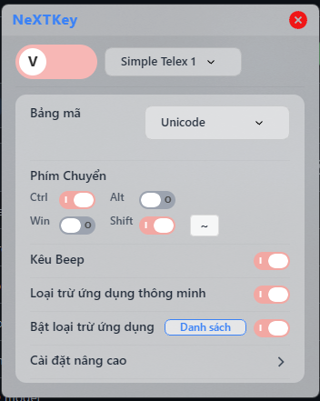
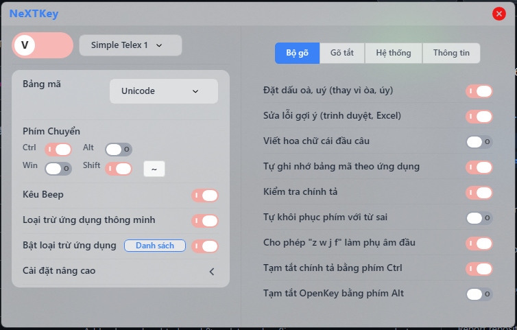

# NexusKey - Modern Vietnamese IME for Windows

[](https://github.com/phatMT97/NextKey/actions/workflows/build.yml)
[](https://www.gnu.org/licenses/gpl-3.0)
[](https://github.com/phatMT97/NextKey/releases)

<p align="center">
  
  
</p>
<p align="center"><em>NexusKey Interface: Compact Mode (Left) and Expanded Settings (Right)</em></p>

<p align="center">
  
</p>
<p align="center"><em>NexusKey Full UI</em></p>

---

## EN - About NexusKey

**NexusKey** is an open-source Vietnamese Input Method Editor (IME) for Windows. It is the successor of [NextKey](https://github.com/phatMT97/NextKey/tree/master), which was forked from [OpenKey](https://github.com/tuyenvm/OpenKey) by Mai Vu Tuyen.

NexusKey is a complete rewrite — new engine, new architecture, lower resource usage, and English UI support.

<a name="privacy-policy"></a>
### Privacy Policy
We take your privacy seriously. **NexusKey is purely an Input Method Editor:**
* **No Keylogging:** We do not collect, store, or transmit your keystrokes.
* **No Data Collection:** No personal data is sent to any server.
* **Offline First:** The software operates entirely locally on your machine.
* **Open Source:** You can verify this behavior by reviewing our source code.

---

## VI - Về NexusKey (Tiếng Việt)

**NexusKey** là bộ gõ tiếng Việt mã nguồn mở cho Windows. Đây là phiên bản kế thừa của [NextKey](https://github.com/phatMT97/NextKey/tree/master), vốn được phát triển từ dự án [OpenKey](https://github.com/tuyenvm/OpenKey) của tác giả Mai Vũ Tuyên.

NexusKey được viết lại hoàn toàn — engine mới, kiến trúc mới, giảm tài nguyên sử dụng, và hỗ trợ giao diện tiếng Anh.

- **Giao diện Glassmorphism** - Thiết kế trong suốt, hiện đại kiểu Windows 11.
- **Hiệu năng cao** - Tối ưu sâu, nhẹ hơn, không gây lag máy.
- **Tính năng mạnh mẽ** - Loại trừ ứng dụng (Game mode), tự động chuyển Anh/Việt.
- **Hỗ trợ TSF** - Tích hợp Text Services Framework cho các ứng dụng hiện đại.

> **Ghi nhận (Credits):** NextKey được xây dựng trên nền tảng OpenKey. NexusKey là bản viết lại toàn bộ kiến trúc và engine từ NextKey. Xin cảm ơn tác giả Mai Vũ Tuyên và cộng đồng.

---

## Features

- **Input methods** — Telex, VNI, Simple Telex
- **Code tables** — Unicode, TCVN3, VNI Windows, Unicode Compound, Vietnamese Locale
- **Spell checker** — Vietnamese spelling validation with configurable strictness
- **Smart switch** — Auto-detect and switch between Vietnamese/English per application
- **Macros** — Custom text expansion (e.g., `addr` → full address)
- **Auto-capitalization** — Capitalize first letter after sentence-ending punctuation
- **Quick consonants** — Double-tap consonants for common Vietnamese pairs
- **Exclude apps** — Disable Vietnamese input in specific applications
- **TSF engine per app** — Use TSF input method instead of keyboard hook for selected apps
- **Per-app code table** — Different code tables for different applications
- **Auto-update** — Built-in update checker and installer
- **Tone placement** — Modern (new-style) and classic (old-style) options
- **Modern UI** — Sciter.JS-powered settings with dark/light theme support
- **English UI** — English interface support

---

## Cài đặt (Installation)

1. Tải về phiên bản mới nhất tại mục **[Releases](https://github.com/phatMT97/NextKey/releases)**.
2. Giải nén và chạy file `NexusKey.exe`.
3. *(Khuyến nghị)* Tắt các bộ gõ khác (Unikey, EVKey) để tránh xung đột.

---

## Building

### Prerequisites

- **Windows 10/11**
- **Visual Studio 2022** (with "Desktop development with C++" workload and ATL support)
- **CMake 3.20+**

All other dependencies (Sciter SDK, Google Test, toml++) are vendored in `extern/`.

### Build

```powershell
cmake -B build -G "Visual Studio 17 2022" -A x64
cmake --build build --config Release --target NextKeyApp
```

### Run Tests

```powershell
cmake --build build --config Release --target NextKeyTests
ctest --test-dir build --build-config Release --output-on-failure
```

---

## Architecture

NexusKey is composed of three layers:

| Layer | Target | Description |
|-------|--------|-------------|
| **NextKeyEngine** | Static lib | Pure C++20 Vietnamese input engines (Telex, VNI), spell checker, code table converter. Zero platform dependencies. |
| **NextKeyCore** | Static lib | Platform layer — shared memory IPC, configuration management, smart switch. |
| **NextKeyApp** | Win32 EXE | GUI application with Sciter.JS UI, hook engine, tray icon, auto-update. |
| **NextKeyTSF** | DLL | Text Services Framework integration — registers as a Windows input method. |

---

## Credits

- Successor of [NextKey](https://github.com/phatMT97/NextKey/tree/master), inspired by [OpenKey](https://github.com/tuyenvm/OpenKey) by Mai Vu Tuyen
- UI powered by [Sciter.JS](https://sciter.com/)
- Configuration parsing by [toml++](https://github.com/marzer/tomlplusplus)
- Testing with [Google Test](https://github.com/google/googletest)

### Top Testers
A special thanks to the following community members for their extensive testing and feedback:
- Zenfas
- huntersun
- haihv8x
- os-hoanghv

## License

This project is licensed under the [GNU General Public License v3.0](https://www.gnu.org/licenses/gpl-3.0.en.html) — see the [LICENSE](LICENSE) file for details.
