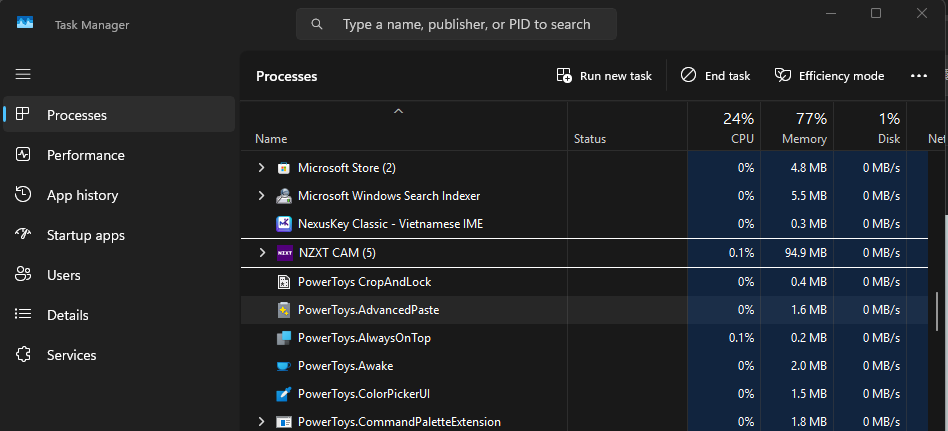

# NexusKey v2.1.13

**✨ Tính năng mới & Cải tiến:**
- Tối ưu Engine
- Tối ưu bộ nhớ — chỉ chiếm ~2 MB RAM khi khởi chạy, hệ thống tự động thu gọn xuống ~0.3 MB mà không ảnh hưởng hiệu năng gõ

  

**🛠 Sửa lỗi:**
- Sửa lỗi VNI thoát composite không đúng gây không thể hoàn tác từ sai
- Sửa lỗi NexusKey không tự chạy khi mở máy do Task Scheduler bị mất — tự động chuyển sang Registry startup và đồng bộ lại cài đặt
- Sửa lỗi không tự cập nhật trên phiên bản Classic

---
Cảm ơn bạn đã lựa chọn NexusKey! Mọi đóng góp của bạn đều là nguồn động lực lớn giúp bộ gõ ngày càng hoàn thiện hơn. ❤️
