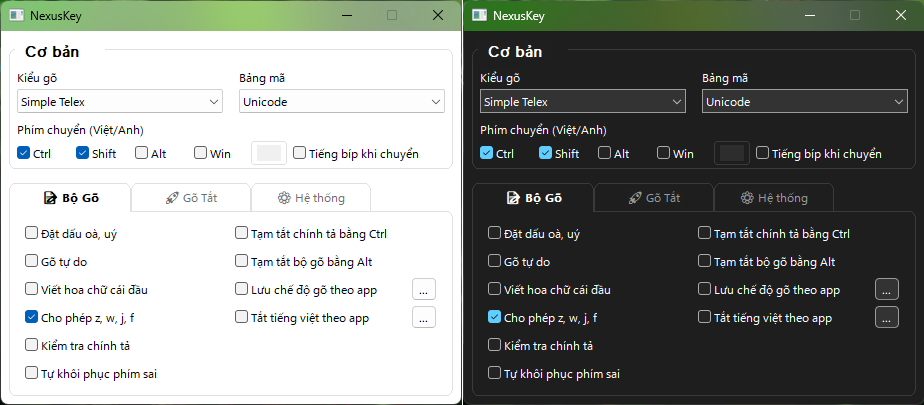

# NexusKey v2.1.11

**✨ Cải tiến:**
- Giao diện Classic — dành cho người dùng thích sự đơn giản (sẽ có trong phiên bản sau)

**🛠 Sửa lỗi:**
- Sửa lỗi: khi fullscreen app (Valorant) đang chạy, toggle mode ở đó cũng ảnh hưởng app phía dưới
- Sửa lỗi telex [] không thoát phím
- Sửa lỗi khoá mode khi chuyển từ CJK <-> Eng

---
Cảm ơn bạn đã chọn NexusKey! Mọi góp ý của bạn đều giúp bộ gõ ngày càng hoàn thiện hơn.
