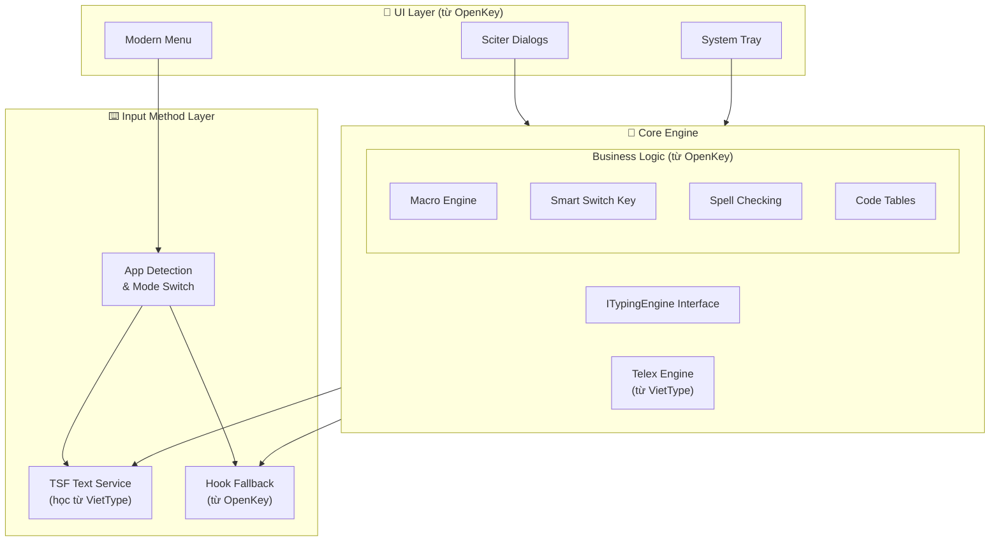
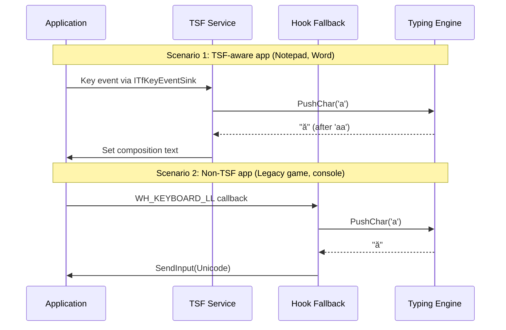

# NextKey-TSF: Kiến Trúc Hybrid TSF + Hook Fallback

> **Mục tiêu**: Xây dựng bộ gõ tiếng Việt thế hệ mới, kết hợp ưu điểm của TSF (Text Services Framework) với độ tin cậy của hook fallback, tận dụng UI Sciter hiện đại từ OpenKey.

---

## 1. Tổng Quan Kiến Trúc



---

## 2. Phân Tích Hai Codebase

### 2.1 VietType - TSF Implementation

| Component | File | Chức năng |
|-----------|------|-----------|
| [TextService](file://wsl.localhost/Ubuntu-24.04/home/phatmt/code/VietType/VietTypeATL/TextService.h#35-36) | [TextService.h](file:///wsl.localhost/Ubuntu-24.04/home/phatmt/code/VietType/VietTypeATL/TextService.h) | Entry point TSF, implements `ITfTextInputProcessorEx` |
| `KeyEventSink` | [KeyEventSink.cpp](file:///wsl.localhost/Ubuntu-24.04/home/phatmt/code/VietType/VietTypeATL/KeyEventSink.cpp) | Xử lý key events từ TSF framework |
| [CompositionManager](file://wsl.localhost/Ubuntu-24.04/home/phatmt/code/VietType/VietTypeATL/CompositionManager.h#11-135) | [CompositionManager.h](file:///wsl.localhost/Ubuntu-24.04/home/phatmt/code/VietType/VietTypeATL/CompositionManager.h) | Quản lý composition text, edit sessions |
| [EngineController](file://wsl.localhost/Ubuntu-24.04/home/phatmt/code/VietType/VietTypeATL/EngineController.h#31-32) | [EngineController.h](file:///wsl.localhost/Ubuntu-24.04/home/phatmt/code/VietType/VietTypeATL/EngineController.h) | Bridge giữa TSF và typing engine |
| [TelexEngine](file://wsl.localhost/Ubuntu-24.04/home/phatmt/code/VietType/Telex/TelexEngine.h#148-149) | [TelexEngine.h](file:///wsl.localhost/Ubuntu-24.04/home/phatmt/code/VietType/Telex/TelexEngine.h) | Core typing logic, state machine |
| [ITelexEngine](file://wsl.localhost/Ubuntu-24.04/home/phatmt/code/VietType/Telex/Telex.h#56-79) | [Telex.h](file:///wsl.localhost/Ubuntu-24.04/home/phatmt/code/VietType/Telex/Telex.h) | Clean interface cho typing engine |

**✅ Ưu điểm VietType**:
- Interface sạch ([ITelexEngine](file://wsl.localhost/Ubuntu-24.04/home/phatmt/code/VietType/Telex/Telex.h#56-79)) với state machine rõ ràng
- Hỗ trợ backconvert cho edit surrounding word
- Modular design, dễ test
- ATL COM chuẩn, production-ready

**⚠️ Hạn chế VietType**:
- Chỉ hỗ trợ Telex/VNI, không có các kiểu gõ khác
- Không có macro, smart switch key
- UI đơn giản (WinForms config dialog)

---

### 2.2 OpenKey - Hook Implementation

| Component | File | Chức năng |
|-----------|------|-----------|
| [OpenKey.cpp](file://wsl.localhost/Ubuntu-24.04/home/phatmt/code/OpenKey/Sources/OpenKey/win32/OpenKey/OpenKey/OpenKey.cpp) | [OpenKey.cpp](file:///wsl.localhost/Ubuntu-24.04/home/phatmt/code/OpenKey/Sources/OpenKey/win32/OpenKey/OpenKey/OpenKey.cpp) | Main hook logic, [keyboardHookProcess](file://wsl.localhost/Ubuntu-24.04/home/phatmt/code/OpenKey/Sources/OpenKey/win32/OpenKey/OpenKey/OpenKey.cpp#264-265) |
| [Engine.cpp](file://wsl.localhost/Ubuntu-24.04/home/phatmt/code/VietType/Telex/TelexEngine.cpp) | [Engine.h](file:///wsl.localhost/Ubuntu-24.04/home/phatmt/code/OpenKey/Sources/OpenKey/engine/Engine.h) | Typing engine với global state |
| [Macro.cpp](file://wsl.localhost/Ubuntu-24.04/home/phatmt/code/OpenKey/Sources/OpenKey/engine/Macro.cpp) | [Macro.h](file:///wsl.localhost/Ubuntu-24.04/home/phatmt/code/OpenKey/Sources/OpenKey/engine/Macro.h) | Macro expansion system |
| [SmartSwitchKey.cpp](file://wsl.localhost/Ubuntu-24.04/home/phatmt/code/OpenKey/Sources/OpenKey/engine/SmartSwitchKey.cpp) | [SmartSwitchKey.h](file:///wsl.localhost/Ubuntu-24.04/home/phatmt/code/OpenKey/Sources/OpenKey/engine/SmartSwitchKey.h) | Auto-switch language per app |
| [SettingsDialog.cpp](file://wsl.localhost/Ubuntu-24.04/home/phatmt/code/OpenKey/Sources/OpenKey/win32/OpenKey/OpenKey/SettingsDialog.cpp) | [SettingsDialog.cpp](file:///wsl.localhost/Ubuntu-24.04/home/phatmt/code/OpenKey/Sources/OpenKey/win32/OpenKey/OpenKey/SettingsDialog.cpp) | Sciter-based settings UI |
| [ConfigManager.cpp](file://wsl.localhost/Ubuntu-24.04/home/phatmt/code/OpenKey/Sources/OpenKey/win32/OpenKey/OpenKey/ConfigManager.cpp) | [ConfigManager.cpp](file:///wsl.localhost/Ubuntu-24.04/home/phatmt/code/OpenKey/Sources/OpenKey/win32/OpenKey/OpenKey/ConfigManager.cpp) | TOML-based configuration |

**✅ Ưu điểm OpenKey**:
- Rich features: Macro, Smart Switch, Quick Convert, etc.
- Modern Sciter UI với effects (blur, acrylic)
- ConfigManager mature với TOML format
- Per-app configuration support

**⚠️ Hạn chế OpenKey**:
- Global state (extern variables) khó maintain
- Hook-only approach - không tương thích một số modern apps
- Engine code phức tạp, khó tách riêng

---

## 3. Kiến Trúc Đề Xuất

### 3.1 Layer Architecture

```
┌─────────────────────────────────────────────────────────────────┐
│                    📱 Application Layer                         │
│  ┌───────────────┐ ┌───────────────┐ ┌───────────────────────┐  │
│  │ System Tray   │ │ Settings      │ │ Dialogs (Macro,       │  │
│  │ (Modern Menu) │ │ Dialog        │ │ Convert Tool, etc.)   │  │
│  └───────────────┘ └───────────────┘ └───────────────────────┘  │
│  [Sciter-based, reuse từ OpenKey]                               │
├─────────────────────────────────────────────────────────────────┤
│                    🔧 Business Logic Layer                       │
│  ┌──────────┐ ┌──────────┐ ┌──────────┐ ┌────────────────────┐  │
│  │ Macro    │ │ Smart    │ │ Code     │ │ Excluded Apps      │  │
│  │ Engine   │ │ Switch   │ │ Tables   │ │ & App Detection    │  │
│  └──────────┘ └──────────┘ └──────────┘ └────────────────────┘  │
│  [Reuse từ OpenKey, refactor thành stateless services]          │
├─────────────────────────────────────────────────────────────────┤
│                    🧠 Typing Engine Layer                        │
│  ┌─────────────────────────────────────────────────────────────┐│
│  │                    ITypingEngine                             ││
│  │   PushChar(), Backspace(), Commit(), Reset(), Retrieve()    ││
│  └─────────────────────────────────────────────────────────────┘│
│        ▲                                     ▲                   │
│        │                                     │                   │
│  ┌─────┴─────┐                        ┌──────┴──────┐           │
│  │TelexEngine│                        │ Legacy VNI  │           │
│  │(VietType) │                        │ (nếu cần)   │           │
│  └───────────┘                        └─────────────┘           │
├─────────────────────────────────────────────────────────────────┤
│                    ⌨️ Input Method Layer                         │
│  ┌─────────────────────────────┐  ┌───────────────────────────┐ │
│  │    TSF Text Service (DLL)   │  │  Hook Fallback (EXE)      │ │
│  │  ┌────────────────────────┐ │  │  ┌────────────────────┐   │ │
│  │  │ KeyEventSink           │ │  │  │ WH_KEYBOARD_LL     │   │ │
│  │  │ CompositionManager     │ │  │  │ SendInput/Clipboard│   │ │
│  │  │ EngineController       │ │  │  └────────────────────┘   │ │
│  │  └────────────────────────┘ │  │  [từ OpenKey]             │ │
│  │  [học từ VietType]          │  │                           │ │
│  └─────────────────────────────┘  └───────────────────────────┘ │
└─────────────────────────────────────────────────────────────────┘
```

### 3.2 Component Mapping

| NextKey-TSF Component | Source | Notes |
|-----------------------|--------|-------|
| `ITypingEngine` interface | **NEW** | Abstract interface, inspired by VietType's [ITelexEngine](file://wsl.localhost/Ubuntu-24.04/home/phatmt/code/VietType/Telex/Telex.h#56-79) |
| [TelexEngine](file://wsl.localhost/Ubuntu-24.04/home/phatmt/code/VietType/Telex/TelexEngine.h#148-149) | **VietType** | Copy với minimal changes |
| `MacroService` | **OpenKey** | Refactor từ [Macro.cpp](file://wsl.localhost/Ubuntu-24.04/home/phatmt/code/OpenKey/Sources/OpenKey/engine/Macro.cpp), làm stateless |
| `SmartSwitchService` | **OpenKey** | Refactor từ [SmartSwitchKey.cpp](file://wsl.localhost/Ubuntu-24.04/home/phatmt/code/OpenKey/Sources/OpenKey/engine/SmartSwitchKey.cpp) |
| `ConfigManager` | **OpenKey** | Reuse trực tiếp |
| TSF DLL | **VietType** (base) + **NextKey** customization | Core TSF components |
| Hook Manager | **OpenKey** | Fallback mode |
| Sciter UI | **OpenKey** | Reuse trực tiếp |
| `AppModeDetector` | **NEW** | Quyết định TSF vs Hook mode |

---

## 4. Integration Points & Challenges

### 4.1 🔴 Critical Challenges

#### Challenge 1: Engine State Model Conflict

```cpp
// VietType: Object-oriented, instance-based
class TelexEngine : public ITelexEngine {
    TelexStates _state;
    std::wstring _keyBuffer;
    // ...
};

// OpenKey: Global state với extern variables
extern int vLanguage;
extern int vInputType;
void vKeyHandleEvent(const vKeyEvent& event, ...);
```

> [!CAUTION]
> OpenKey engine dùng **global state** trong khi VietType dùng **instance-based state**. Đây là conflict lớn nhất cần giải quyết.

**Proposed Solution**:
1. Adopt VietType's [ITelexEngine](file://wsl.localhost/Ubuntu-24.04/home/phatmt/code/VietType/Telex/Telex.h#56-79) interface làm core
2. Wrap OpenKey settings thành [TelexConfig](file://wsl.localhost/Ubuntu-24.04/home/phatmt/code/VietType/Telex/Telex.h#41-55) equivalent
3. OpenKey business logic (Macro, SmartSwitch) hoạt động trên output của `ITypingEngine`

---

#### Challenge 2: TSF + Hook Coexistence



> [!IMPORTANT]
> **Question for Discussion**: Làm sao detect app nào support TSF và app nào không?

**Options**:
1. **Whitelist/Blacklist approach** - User configure
2. **Try TSF first, fallback on failure** - Runtime detection
3. **Per-process COM registration check** - Heuristic

---

#### Challenge 3: Shared State between TSF DLL and Main EXE

TSF Text Service runs **in-process** (trong process của target app), trong khi:
- Settings dialog cần chạy trong main EXE
- Configuration changes cần sync real-time

```
┌─────────────────┐         ┌─────────────────┐
│  notepad.exe    │         │  NextKey.exe    │
│  ┌───────────┐  │         │  ┌───────────┐  │
│  │ TSF DLL   │  │ ← IPC → │  │ Sciter UI │  │
│  │ instance  │  │         │  │ + Config  │  │
│  └───────────┘  │         │  └───────────┘  │
└─────────────────┘         └─────────────────┘
```

> [!WARNING]
> Cần IPC mechanism để sync settings giữa TSF DLL instances và main process.

**Options**:
1. **Shared Memory** - Fast, but complex lifetime management
2. **Named Pipe/Mailslot** - Windows-native IPC
3. **File-based + FileSystemWatcher** - Simple, reliable (VietType approach)
4. **COM Compartments** - TSF-native mechanism (VietType dùng)

---

### 4.2 🟡 Moderate Challenges

#### Challenge 4: Macro Integration

OpenKey macros work by intercepting **before** typing engine processes the key. With TSF, the flow is different:

```cpp
// Current OpenKey flow:
1. Hook gets key 'b'
2. Check macro: "btw" → "by the way"?
3. If match pending, buffer. If complete, expand.

// TSF flow:
1. KeyEventSink.OnKeyDown('b')
2. ??? Where does macro check go?
```

**Proposed Solution**:
- Macro processing happens in `ITypingEngine` layer
- TSF/Hook layer provides raw key input
- Engine returns either typed characters OR macro expansion

---

#### Challenge 5: Smart Switch Key Sync

Smart Switch remembers language per-app. With TSF:
- Each app process has its own DLL instance
- State is per-instance, not global

**Proposed Solution**:
- SmartSwitch data stored in shared config file
- Each TSF instance reads on focus-in
- Main EXE handles persistence

---

### 4.3 🟢 Lower Priority Considerations

#### Code Table Support
- VietType: Unicode only
- OpenKey: Unicode, TCVN3, VNI, Unicode Compound

**Decision needed**: Có cần support non-Unicode tables trong TSF mode?

#### Quick Convert Feature
- Works via clipboard manipulation
- Should work regardless of input method (TSF or Hook)

---

## 5. Proposed Project Structure

```
NextKey-TSF/
├── lib/                           # Third-party libraries
│   ├── sciter/                    # Sciter SDK
│   │   ├── include/
│   │   └── bin/
│   └── toml/                      # TOML++ library
│
├── src/
│   ├── core/                      # Shared core logic
│   │   ├── engine/
│   │   │   ├── ITypingEngine.h    # Abstract interface
│   │   │   ├── TelexEngine.cpp    # From VietType
│   │   │   └── TelexEngine.h
│   │   ├── services/
│   │   │   ├── MacroService.h     # From OpenKey, refactored
│   │   │   ├── SmartSwitchService.h
│   │   │   └── SpellCheckService.h
│   │   └── config/
│   │       ├── ConfigManager.cpp  # From OpenKey
│   │       └── NextKey.toml       # Single source of truth
│   │
│   ├── tsf/                       # TSF Text Service DLL
│   │   ├── TextService.cpp        # From VietType
│   │   ├── KeyEventSink.cpp
│   │   ├── CompositionManager.cpp
│   │   ├── EngineController.cpp
│   │   └── NextKeyTSF.def
│   │
│   ├── hook/                      # Hook fallback module
│   │   ├── HookManager.cpp
│   │   └── InputInjector.cpp
│   │
│   └── ui/                        # Sciter UI (client only)
│       ├── sciter/                # HTML/CSS/TIScript
│       ├── UIBridge.cpp           # Message bridge to BE
│       ├── UIBackend.cpp          # Worker thread, async only
│       ├── StateAggregator.cpp    # Atomic state snapshot
│       └── EventBus.cpp           # Lock-free event dispatch
│
├── installer/
└── docs/
```

---

## 5.1 Sciter UI Backend Architecture 🎨

> [!CAUTION]
> **Sciter UI = Client, Engine = Server, TOML = Database**
> Sciter lag 5-10ms là user thấy khựng. Phải thiết kế từ đầu đúng cách.

### Core Principles

| # | Nguyên tắc | ❌ KHÔNG | ✅ PHẢI |
|---|------------|----------|---------|
| 1 | **Event-driven** | UI hỏi → BE tính → trả | BE chủ động push state |
| 2 | **Zero logic in UI** | JS xử lý engine/config | JS chỉ render + gửi intent |
| 3 | **Async 100%** | SendMessage sync, WaitForSingleObject | Fire-and-forget, lock-free |
| 4 | **Single state snapshot** | Query lung tung | Atomic struct copy |
| 5 | **DWM blur độc quyền** | Sciter backdrop-filter | DwmSetWindowAttribute |
| 6 | **No background Sciter** | Sciter window chạy ngầm | Mở → dùng → đóng |

### Architecture Flow

```
Core Engine (TSF / Hook)
        ↓
State Aggregator (atomic struct)
        ↓
Event Bus (lock-free queue)
        ↓
UI Bridge (Sciter C++ bindings)
        ↓
Sciter UI (render only)
```

### State Model

```cpp
// Single source of truth - immutable snapshot
struct UIState {
    bool vietnamese;
    bool macroEnabled;
    bool tsfActive;
    int inputMethod;
    int macroCount;
};

// BE emits, UI renders
void onStateChanged(const UIState& newState) {
    currentState = newState;  // Atomic swap
    NotifyUI(currentState);   // Push, không pull
}
```

### Message Protocol

```cpp
// UI → BE: Intent only
JS: send("toggle_macro");

// BE → UI: JSON snapshot
BE: emit({ type: "stateChanged", state: {...} });
```

### DWM Blur (không phải Sciter blur)

```cpp
// ✅ Đúng: DWM blur nền, Sciter vẽ chữ
DwmSetWindowAttribute(hwnd, DWMWA_SYSTEMBACKDROP_TYPE, 
                      DWMSBT_MAINWINDOW);  // Mica/Acrylic

// Sciter CSS: KHÔNG blur
html { background: transparent; opacity: 1; }
// ❌ Sai: backdrop-filter: blur()
```

### TOML = Shared State Database

```
UI change → write TOML → update timestamp
TSF/Hook → detect change → reload snapshot → atomic swap
```

- Không global extern
- Không IPC cho config
- Không registry
- Không live mutation

> **Config là immutable snapshot. Muốn đổi → tạo cái mới → thay toàn bộ.**

## 6. Migration Path

### Phase 1: Foundation (2-3 weeks)
- [ ] Setup NextKey-TSF project structure
- [ ] Copy TelexEngine from VietType (minimal changes)
- [ ] Create `ITypingEngine` interface
- [ ] Setup basic TSF registration

### Phase 2: TSF Core (3-4 weeks)
- [ ] Port VietType TSF components (TextService, KeyEventSink, CompositionManager)
- [ ] Integrate with TelexEngine
- [ ] Basic Vietnamese typing works via TSF

### Phase 3: Business Logic (2-3 weeks)
- [ ] Port MacroService from OpenKey
- [ ] Port SmartSwitchService
- [ ] Implement settings sync (IPC)

### Phase 4: UI Integration (2-3 weeks)
- [ ] Port Sciter UI from OpenKey
- [ ] Connect to TSF service via IPC
- [ ] System tray with mode indicator

### Phase 5: Hook Fallback (2 weeks)
- [ ] Port hook logic from OpenKey
- [ ] Implement app detection for mode switching
- [ ] Testing with legacy apps

### Phase 6: Polish & Release (2-3 weeks)
- [ ] Installer with TSF registration
- [ ] Settings migration from OpenKey
- [ ] Documentation

---

## 7. Finalized Decisions ✅

> [!NOTE]
> Các quyết định đã được chốt sau khi tham khảo ý kiến từ nhiều nguồn AI (Gemini, ChatGPT).

### Q1: Engine Choice ✅
**Quyết định**: VietType structure + Port OpenKey features

- Dùng **VietType's TelexEngine** làm core (instance-based, TSF-compatible)
- **Port features** từ OpenKey (macro, quick consonants, VNI variants) vào engine layer
- OpenKey engine không dùng trực tiếp vì global state

---

### Q2: TSF/Hook Mode Detection ✅
**Quyết định**: Hybrid approach (Default TSF + Runtime fallback + Blacklist)

1. **Default TSF** cho tất cả apps
2. **Runtime detection**: Nếu TSF fail (composition không work) → auto-add to blacklist
3. **User-editable blacklist** cho manual override (games, legacy apps)

---

### Q3: IPC Mechanism ✅
**Quyết định**: File-based + File watcher (như VietType)

- Config changes không cần microsecond latency
- Simple, proven, debug dễ
- VietType đã chứng minh hoạt động tốt với approach này
- Tránh COM hell và deadlock issues

---

### Q4: Branding & Versioning ✅
- **Name**: **NextKey**
- **Version**: **1.0** (kiến trúc mới hoàn toàn)
- **License**: **GPL3** (bắt buộc vì fork từ GPL sources)

---

### Q5: Legacy Code Table Support ✅
**Quyết định**: Unicode only cho TSF, legacy tables chỉ ở Hook mode

- **TSF mode**: Chỉ Unicode (Dựng sẵn/Tổ hợp)
- **Hook fallback**: Full support (TCVN3, VNI Windows, etc.)
- Lý do: TSF sinh ra cho Unicode world, ép legacy encoding vào modern apps sẽ gây lỗi

---

### Key Architecture Principle ⭐
> **TSF/Hook = Transport Layer, Engine = Brain**

TSF chỉ làm:
- Nhận phím
- Hiển thị composition
- Commit text

Toàn bộ business logic (macro, smart switch, spell check) nằm trong `ITypingEngine` + Services layer.

---

## 8. Verification Plan

### Automated Tests
- Unit tests cho `ITypingEngine` implementations (TelexEngine)
- Integration tests cho MacroService
- COM registration tests cho TSF DLL

### Manual Testing
1. **TSF Mode**: Test trong Notepad, Word, VS Code
2. **Hook Fallback**: Test trong legacy apps (games, old software)
3. **Mode Switching**: Verify automatic detection works
4. **Settings Sync**: Change settings in UI, verify TSF reflects changes
5. **Macro**: Test macro expansion in both modes

---

> [!NOTE]
> Document này là bản draft để thảo luận. Sau khi team đồng ý về architecture, sẽ tạo detailed implementation tasks.
